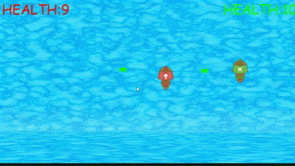

# **Pirate Attacks!**

# description:

This is game build using pygame module in python. There are 2 ships which can fire 2 cannon balls at a time. It is two player offline pc game.If the health of one player becomes zero the other player wins and then the game again starts after 5 second. 

# Controls:

## Controls of red ship: 

  w - up
  
  s - down
  
  a- left
  
  d -right
  
  q - fire cannon ball from left side
  
  e - fire cannon ball from right side

## Controls of green ship:

  Up arrow key - up
  
  down arrow key - down
  
  left arrow key - left
  
  right arrow key - right 
  
  Right Ctrl key - fire cannon ball from left side
  
  0 - fire cannon ball from right side

# Tutorial:

The tutorial I used to learn pygame: 
  (https://youtu.be/jO6qQDNa2UY)

